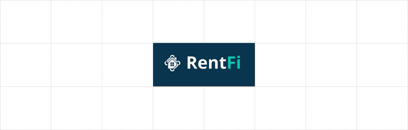

    
    <h1>RentFi</h1>
    <strong>Immutable and transparent residential property leasing 🏠</strong>

     
    <a href="#-about-rentfi"><b>About</b></a>
    •
    <a href="#-environments"><b>Environments</b></a>
    •
    <a href="#-local-development"><b>Local Development</b></a>
    •
    <a href="https://github.com/hschickdevs/RentFi/issues"><b>Issues</b></a>
    •    
    <a href="#-license"><b>License</b></a>

## 🏠 About RentFi

RentFi is a cutting-edge decentralized application (dApp) that leverages the power of smart contracts to provide a decentralized platform for users to create, sign, and trade lease agreements for residential properties.

We aim to solve the following problems plaguing the existing residential leasing landscape:

* **Price Gauging:** Unfair pricing occurs in existing deals due to a lack of transparency. With RentFi, lessees are protected from unfair pricing by the use of public contracts and public data.
* **Excessive Paper Trails:** Existing lease agreements involve an extensive and often disorganized paper trail of legal documents. With RentFi, all aspects of the transaction are recorded on the blockchain's immutable digital ledger.
* **Transaction Velocity:** RentFi uses blockchain technology to speed up the property leasing process. Smart contracts automate critical steps such as credit checks, lease execution, and payments. This reduces the need for manual processing, allowing transactions to be completed swiftly once all conditions are met.
* **Title Fraud/Disputes:** RentFi minimizes title fraud and disputes using blockchain’s immutable ledger. This secure record of property ownership and lease agreements reduces the risk of document manipulation. In disputes, this ledger serves as a clear and accessible reference, simplifying resolution.

> _View our Pitch Deck Here:_ [**🔗 RentFi Pitch Deck.pdf**](frontend/img/RentFi%20Pitch%20Deck.pdf)

## 📦 Environments

| Name    | Link                 |
| ------- |----------------------|
| Mainnet | _In Development ..._ |
| Testnet | _In Development ..._ |

## 👨🏻‍💻 Local Development

> [**🔗 Blockchain Development Documentation**](frontend/README.md) 

> [**🔗 Frontend Development Documentation**](blockchain/README.md)

## ⚖️ License

RentFi is open-sourced software licensed under the © [AGPLv3](LICENSE.txt).