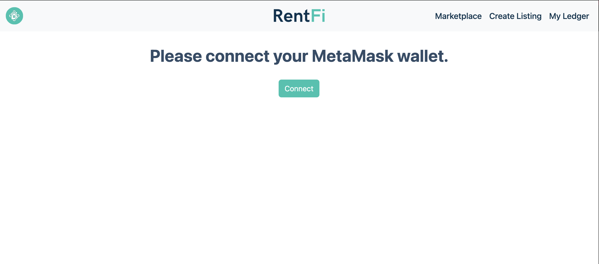
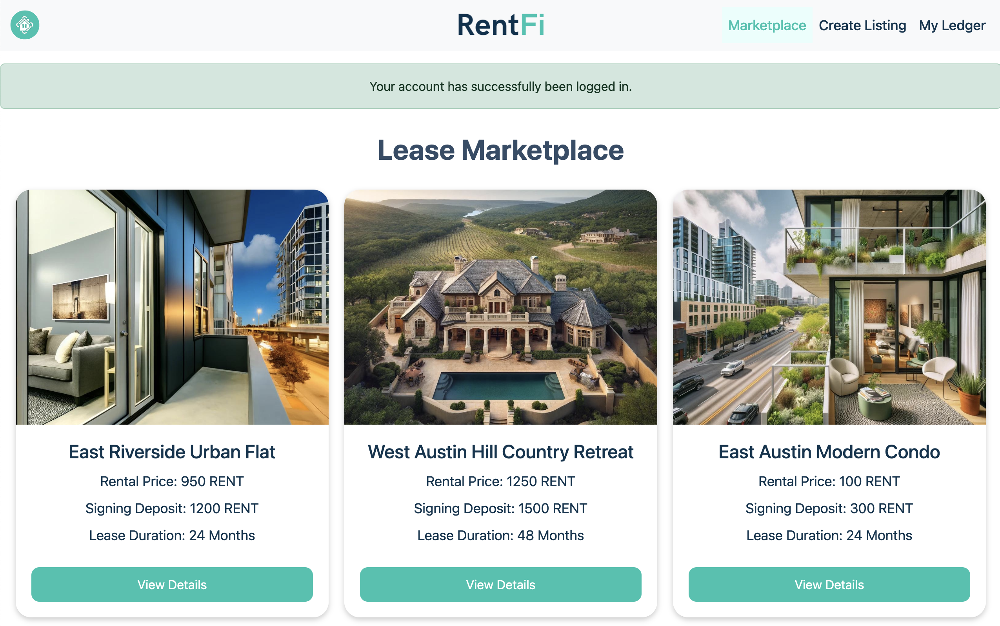
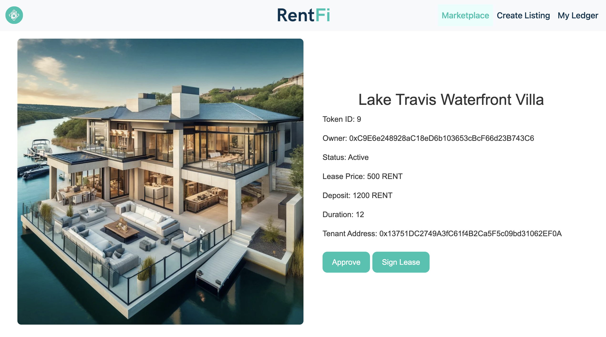
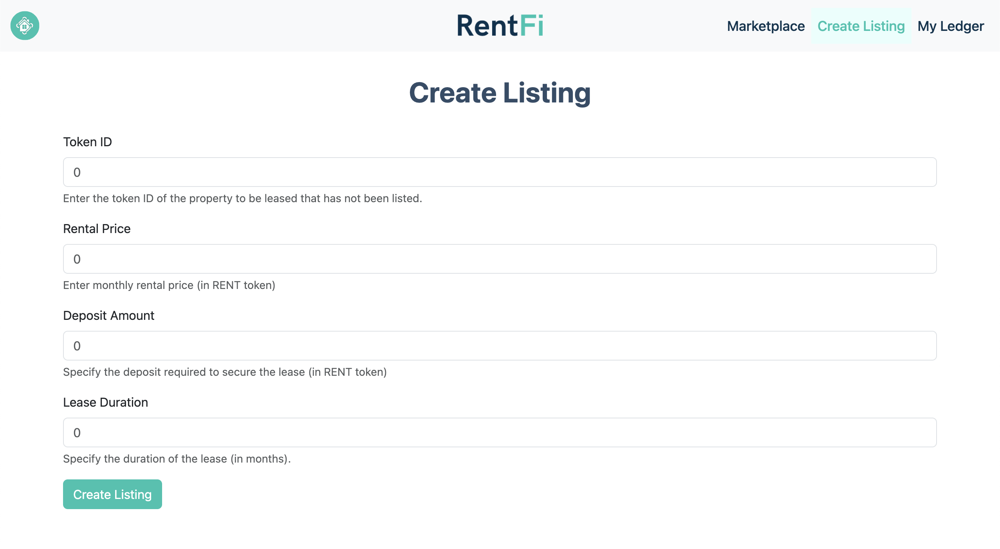
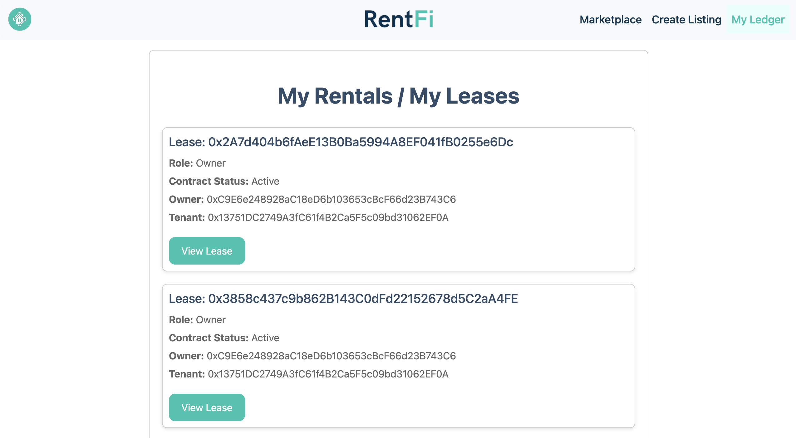

<div align="center">
    
    <h1>RentFi</h1>
    <strong>Immutable and transparent residential property leasing 🏠</strong>
</div>

<div align="center" class="navbar">
    <br>
    <a href="#-about-rentfi"><b>About</b></a>
    •
    <a href="#-demo"><b>Demo</b></a>
    •
    <a href="#-installation--setup"><b>Installation & Setup</b></a>
    •
    <a href="https://github.com/hschickdevs/RentFi/issues"><b>Issues</b></a>
    •    
    <a href="#-license"><b>License</b></a>
</div>

## 🏠 About RentFi

RentFi is a cutting-edge decentralized application (dApp) that leverages the power of smart contracts to provide a decentralized platform for users to create, sign, and trade lease agreements for residential properties.

We aim to solve the following problems plaguing the existing residential leasing landscape:

* **Price Gauging:** Unfair pricing occurs in existing deals due to a lack of transparency and information asymmetry between the lessor and lessee. With RentFi, lessees are protected from unfair pricing by the use of public contracts and public data.
* **Excessive Paper Trails:** Existing lease agreements involve an extensive and often disorganized paper trail of legal documents. With RentFi, all aspects of the transaction are recorded on the blockchain's immutable digital ledger.
* **Transaction Velocity:** RentFi uses blockchain technology to speed up the property leasing process. Smart contracts automate critical steps such as credit checks, lease execution, and payments. This reduces the need for manual processing, allowing transactions to be completed swiftly once all conditions are met.
* **Title Fraud/Disputes:** RentFi minimizes title fraud and disputes using blockchain’s immutable ledger. This secure record of property ownership and lease agreements reduces the risk of document manipulation. In disputes, this ledger serves as a clear and accessible reference, simplifying resolution.

> _View our Pitch Deck Here:_ [**🔗 RentFi Pitch Deck.pdf**](public/RentFi%20Pitch%20Deck.pdf)

## 📦 Installation & Setup

Follow the steps below to install and deploy RentFi on your local machine and the bockchain. First clone the repository:

```bash
git clone https://github.com/hschickdevs/RentFi.git
```

### ⛓️ Blockchain Environment Setup

RentFi is built on the Ethereum blockchain, but the contracts can be deployed on any . To deploy the smart contracts, we have used [Remix IDE](https://remix.ethereum.org/) to manually compile and deploy. For more information on the contracts, see [contracts/SmartContractsDev.md](contracts/SmartContractsDev.md).

1. Deploy the `contracts/RentFiToken.sol` contract. This is the utility token for the platform and is required to deploy the factory contract.

2. Deploy the `contracts/PropertyRegistryNFT.sol` contract. This is the NFT contract that represents the properties on the platform.

3. Deploy the `contracts/LeaseAgreementFactory.sol` contract. In deploying this contract, you will need to pass the addresses of the `RentFiToken` and `PropertyRegistryNFT` contracts as arguments.

4. Set the address of the `RentFiToken` and `LeaseAgreementFactory` contracts in their respective `src/contracts` files.

> **Note:** The LeaseAgreementFactory will be empty at this point, you will need to mint new NFTs on the PropertyRegistryNFT contract and then create new lease agreements using the factory.

### 🖥️ Web Application Setup

To run the RentFi web application, you will need [npm and Node.js](https://docs.npmjs.com/downloading-and-installing-node-js-and-npm) installed on your machine. Once these are installed:

1. Install the required dependencies:
    ```bash
    npm install
    ```

2. Start the development server:
    ```bash
    npm start
    ```

## 🌐 Demo

### `index.js`



### `propertyList.js`



### `propertyDetails.js`



### `createListing.js`



### `ledger.js`



## ⚖️ License

RentFi is open-sourced software licensed under the © [AGPLv3](LICENSE.txt).
